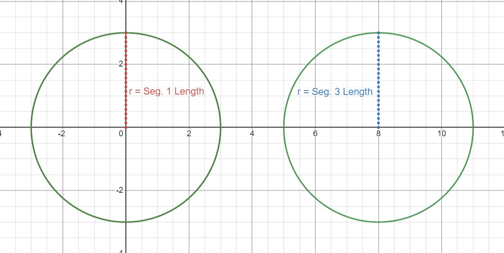
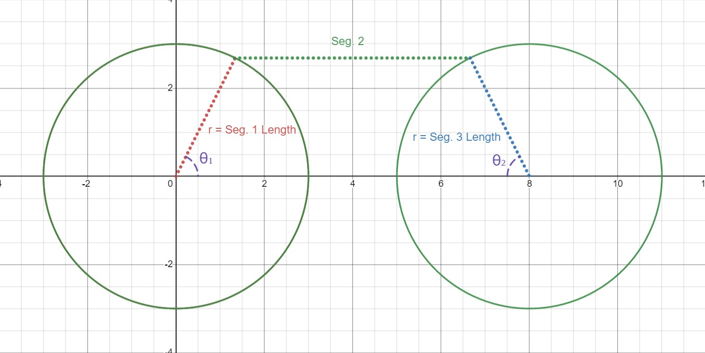

# ARMBot
> The *ARM* in *ARMBot* does not stand for anything!
## An Introduction of Sorts
*ARMBot* is a 3 segmented, mechanical manipulator built for lightweight, mid-level precision object manipulation. It is primarily 3D printed, and driven by stepper and servo motors. The driving of the motors is done on an arduino, and the logic is done on a Raspberry Pi.

## Inverse Kinematics
> https://en.wikipedia.org/wiki/Inverse_kinematics (In case you need to catch up)

My understand of IK is pretty rudementary, so I took a geometric approach to this problem rather than one of the many already known solutions to the problem

### My Approach

My method involves using circles to represent all possible angle configurations of the first and last arm segments around the "shoulder" and final desired position of the "hand". To begin, reduce the problem to just one dimension; Find a way to cover the distance between the "shoulder" and the "hand". The rest can be dealt with later.

> Visual representation. Demonstrates how a circle can be made to represent all endpoints of an arm segment when revolved around a point.

From here, you can imagine that if we could find two points on the two circles that are exactly the length of the second segment, we could use inverse trigonometric functions to determine the angle from the x-axis to such a point. 

> Demonstrates how the ability to find a pair of points along two circles exactly some distance away from each other would allow you to produce angles.

For my specific use case, I am guaranteed that all of the arm segments will be of exactly the same length. If the first and third segment of the arm are the same length (of course meaning those circles are the same radius,) it is possible to obtain a pair of points that are exactly some distance apart from each other by simply sliding the "hand" circle toward the "shoulder" circle by that distance. Wherever the circles intersect you will find points that are exactly that distance apart.

> Demonstrates how moving the circles together will produce points exactly some distance apart.

From here, simply calculate the intersection of these circles, then use inverse sine to produce angles.

For simplicity sake, I did not use $x^2+y^2 = r^2$ in my actual implementation, but rather the semicircle function, $f(x)=\sqrt{r^2-x^2}$. This has the added benefit of meaning that I will not have to deal with negative results later.

This specific approach does **not** fully work in the case that your first and last segments are not the same size (and in fact does not fully work when they are, either). Consider two points on the tops of two differently sized circles. These points could be exactly $s_2$ (where $s_2$ is the length of segment 2) from each other, but they will never intersect if you only move the circle along the x-axis. This means that there can be combinations that are not found by this approach, thereby limiting the actual usefulness of the idea as a whole. If you have a way around this (*i.e.* know how to find a pair of points on two circles that are exactly $s_2$ apart from each other,) please let me know (reilley.pfrimmer@gmail.com)

### Alternative Approaches I Have Tried
*Coming soon!*

## Design

*Coming soon!*

## Everything else
*Coming soon!*
